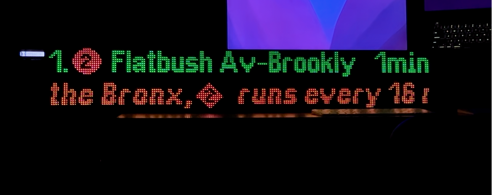

# NYC Subway Sign



A real-time MTA subway arrival display built with a Raspberry Pi 4 and LED matrix panels. Shows live train arrivals and service alerts using official GTFS-RT feeds.

## Features

- **Real-time arrivals** from MTA GTFS-RT feeds with 20-second refresh
- **Service alerts** with scrolling ticker display, triggered when trains arrive
- **Multi-platform support** for complex stations (e.g., Times Square with 8+ platforms)
- **Automatic station detection** via fuzzy name matching against 472-station database
- **Web control interface** for remote configuration without SSH
- **Hot-reload configuration** - changes apply within 5 seconds, no restart needed
- **Graceful degradation** - displays stale data during API outages

## Tech Stack

**Hardware:** Raspberry Pi 4 | 3x 64x32 LED Matrix Panels (192x32 total)

**Software:** Python 3 | Flask | Pillow | nyct-gtfs | rpi-rgb-led-matrix

## Hardware Requirements

- Raspberry Pi 4 (2GB+ RAM recommended)
- 3x 64x32 RGB LED Matrix panels (HUB75 interface)
- 5V 20A power supply for LED panels
- Adafruit RGB Matrix Bonnet or equivalent HAT

## Quick Start

### 1. Clone and Configure

```bash
git clone https://github.com/YOUR_USERNAME/subway-sign.git
cd subway-sign

# Copy example config
cp config.example.json config.json

# Edit with your station
nano config.json
```

### 2. Install Dependencies

```bash
pip install -r requirements.txt

# On Raspberry Pi, also install the LED matrix library:
# https://github.com/hzeller/rpi-rgb-led-matrix
```

### 3. Run

```bash
# On Raspberry Pi (requires root for GPIO)
sudo python3 run.py

# On Mac/Linux for development (uses mock display)
python3 run.py
```

### 4. Web Interface (Optional)

```bash
python3 web/app.py
# Access at http://localhost:5001
```

## Configuration

Edit `config.json` to set your station:

```json
{
  "station": {
    "station_name": "Times Sq-42 St",
    "routes": ["1", "2", "3", "7", "N", "Q", "R", "W", "S"]
  },
  "display": {
    "brightness": 0.3,
    "max_trains": 7,
    "show_alerts": true
  }
}
```

The `station_name` field uses fuzzy matching - try names like:
- `"34 St-Herald Sq"` (Herald Square)
- `"Grand Central-42 St"` (Grand Central)
- `"Times Sq-42 St"` (Times Square)

## Architecture

```
Main Thread (30 FPS render loop)
    ^ snapshot_queue (non-blocking read)
    |
Background Thread (fetches every 20s/60s)
    | creates immutable DisplaySnapshot
    v
Web Thread (Flask, optional)
    | config changes via HTTP
```

Key design principles:
- **Queue-based threading** - no locks in the render path
- **Immutable data structures** - frozen dataclasses eliminate race conditions
- **Simple frame timing** - fixed 33ms frame budget, no complex debt tracking

## Project Structure

```
subway-sign/
├── run.py              # Entry point
├── config.json         # Your configuration (gitignored)
├── src/
│   ├── main.py         # Main loop orchestration
│   ├── mta/            # MTA API client and data models
│   └── display/        # Rendering and fonts
├── web/                # Flask web interface
├── assets/             # Fonts, icons, station database
└── docs/               # Additional documentation
```

## Deployment

See [docs/DEPLOYMENT.md](docs/DEPLOYMENT.md) for detailed Raspberry Pi setup instructions, including systemd service configuration.

Example files are provided:
- `deploy.example.sh` - Deployment script template
- `systemd/*.service.example` - systemd unit file templates

## Acknowledgments

- **[MTA](https://new.mta.info/)** - Real-time subway data via GTFS-RT feeds
- **[ColeWorks](https://www.coleworks.co/)** - MTA Countdown Clock font (CC0 license)
- **[hzeller/rpi-rgb-led-matrix](https://github.com/hzeller/rpi-rgb-led-matrix)** - LED matrix driver
- **[Andrew Dickinson/nyct-gtfs](https://github.com/Andrew-Dickinson/nyct-gtfs)** - MTA feed parsing
- **[Claude](https://claude.ai)** - AI pair programming

## License

MIT License - see [LICENSE](LICENSE) for details.
